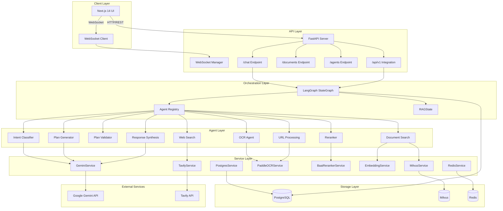
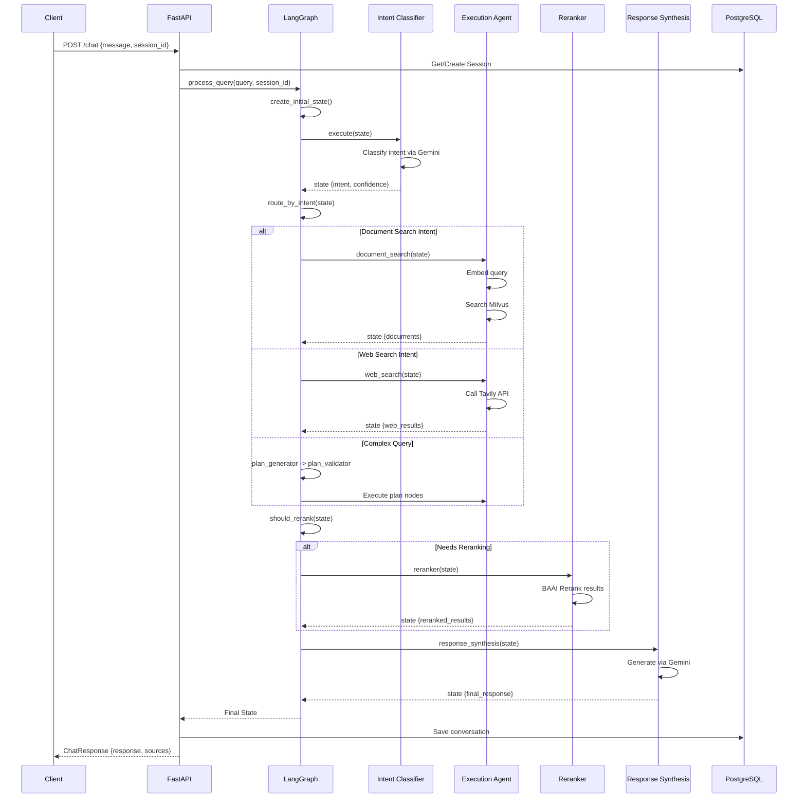
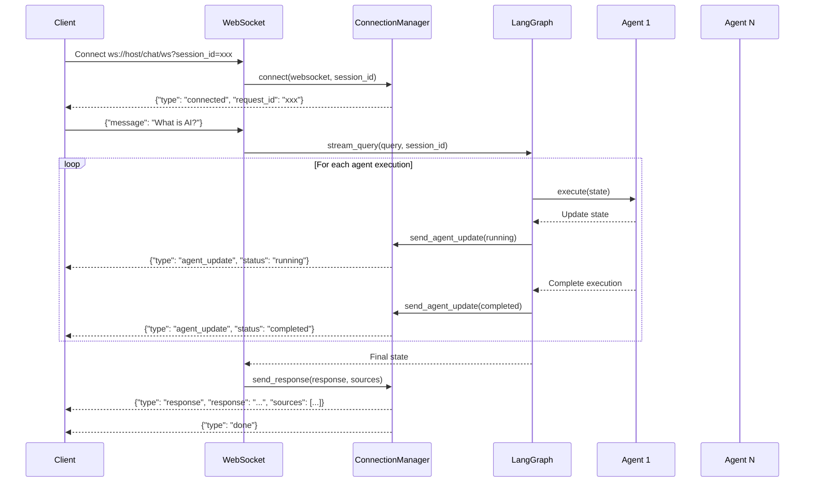
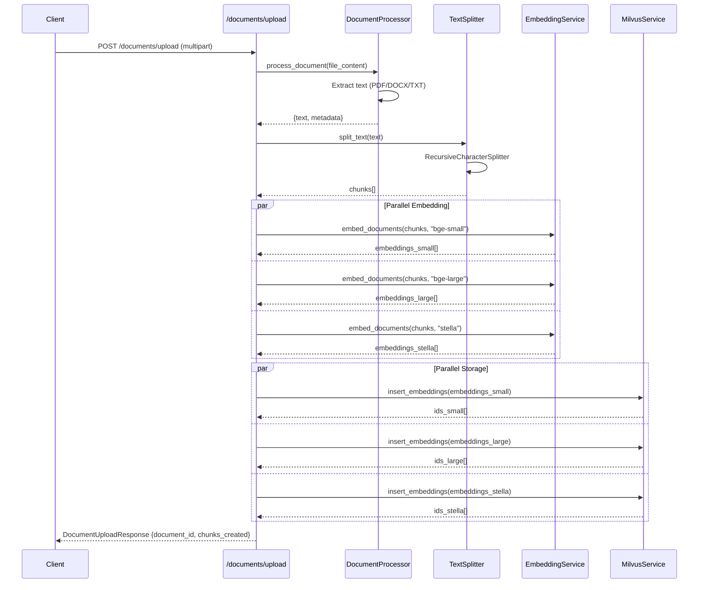
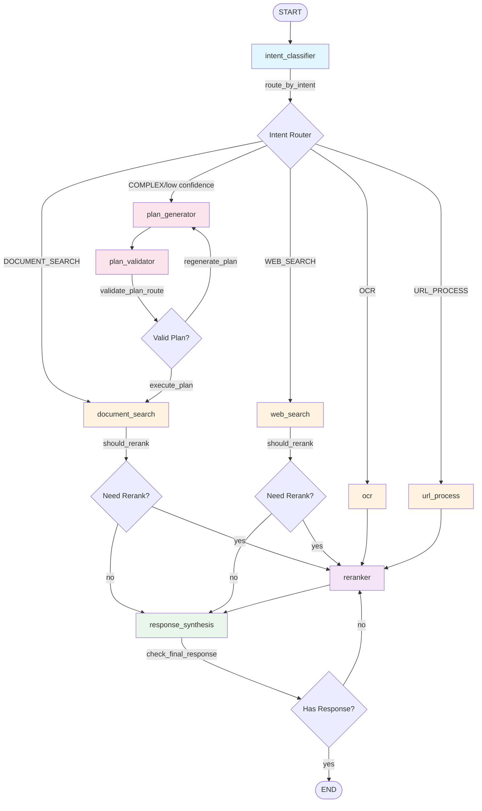
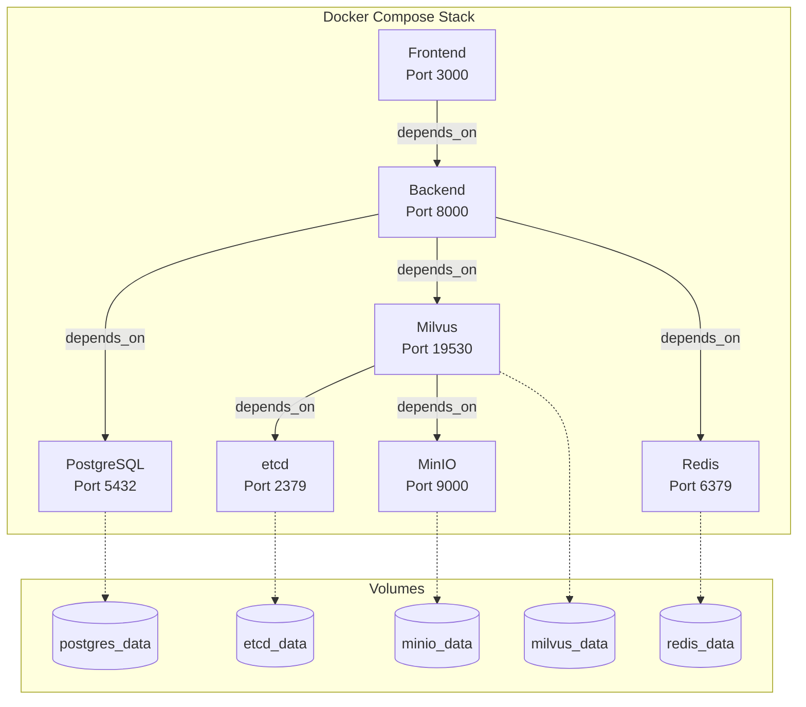

# RAG Chatbot - System Architecture Documentation

## Table of Contents

1. [System Overview](#1-system-overview)
2. [Architecture Diagrams](#2-architecture-diagrams)
3. [API Documentation](#3-api-documentation)
4. [Agent Workflow](#4-agent-workflow)
5. [Deployment Guide](#5-deployment-guide)
6. [Service Layer](#6-service-layer)

---

## 1. System Overview

The RAG Chatbot is a multi-agent Retrieval-Augmented Generation system built with **FastAPI**, **LangGraph**, and **Next.js 14**. It orchestrates multiple specialized agents through a state graph to process user queries, retrieve information from various sources, and synthesize comprehensive responses.

### Key Architectural Patterns

| Pattern | Implementation |
|---------|---------------|
| **Agent Registry** | Decorator-based auto-registration (`@register_agent`) |
| **State Graph** | LangGraph StateGraph for workflow orchestration |
| **Intent-Based Routing** | Queries classified and routed to appropriate agents |
| **Multi-Model Embeddings** | 3 embedding models (bge-small, bge-large, stella) |
| **Checkpointing** | PostgreSQL-based conversation memory |
| **Real-time Streaming** | WebSocket for agent execution updates |

### Technology Stack

| Layer | Technology | Purpose |
|-------|------------|---------|
| **Frontend** | Next.js 14 | UI/UX |
| | Zustand | State Management |
| | Tailwind CSS | Styling |
| | Shadcn/ui | UI Components |
| **Backend** | FastAPI | REST API |
| | LangGraph | Agent Orchestration |
| | Pydantic | Validation |
| **AI/ML Services** | Google Gemini | LLM Generation |
| | SentenceTransformers | Embeddings |
| | BAAI Reranker | Result Ranking |
| | PaddleOCR | Text Extraction |
| **Data Stores** | PostgreSQL | Conversations |
| | Milvus | Vector Search |
| | Redis | Caching |
| **External APIs** | Tavily | Web Search |

---

## 2. Architecture Diagrams

### 2.1 System Overview (Mermaid Flowchart)



### 2.2 Request Flow Sequence Diagram



### 2.3 WebSocket Streaming Sequence



### 2.4 Document Upload Flow



---

## 3. API Documentation

### 3.1 Base URL

```
Development: http://localhost:8000
Production: https://your-domain.com
```

### 3.2 REST Endpoints

#### Root and Health

| Method | Endpoint | Description |
|--------|----------|-------------|
| GET | `/` | API information and available endpoints |
| GET | `/health` | Health check with service status |

**GET / Response:**

```json
{
  "name": "RAG Chatbot API",
  "version": "2.0.0",
  "status": "running",
  "features": [
    "Intent classification",
    "Plan generation & validation",
    "Document search (Milvus)",
    "Web search (Tavily)",
    "OCR (PaddleOCR)",
    "Multi-model embeddings",
    "BAAI reranker",
    "WebSocket streaming"
  ],
  "endpoints": {
    "chat": "/chat",
    "websocket": "/chat/ws",
    "documents": "/documents",
    "health": "/health",
    "docs": "/docs"
  }
}
```

**GET /health Response:**

```json
{
  "status": "healthy",
  "database": "configured",
  "milvus": {
    "status": "connected",
    "count": 1234
  },
  "redis": "connected"
}
```

---

#### Chat Endpoints

##### POST /chat

Process a chat message through the RAG system.

**Request Body:**

```json
{
  "message": "What is machine learning?",
  "session_id": "optional-session-id"
}
```

| Field | Type | Required | Description |
|-------|------|----------|-------------|
| message | string | Yes | User's query message |
| session_id | string | No | Session identifier (default: "default") |

**Response (200 OK):**

```json
{
  "response": "Machine learning is a subset of artificial intelligence...",
  "sources": [
    {
      "title": "Introduction to ML",
      "url": "https://example.com/ml-intro",
      "score": 0.95
    }
  ],
  "session_id": "user-session-123",
  "agent_executions": [
    {
      "agent_id": "intent_classifier",
      "agent_name": "Intent Classifier",
      "status": "completed",
      "started_at": "2026-03-22T10:00:00Z",
      "completed_at": "2026-03-22T10:00:01Z"
    }
  ]
}
```

---

#### WebSocket /chat/ws

Real-time chat with agent execution updates.

**Connection URL:**

```
ws://localhost:8000/chat/ws?session_id=your-session-id
```

**Client Message:**

```json
{
  "message": "What is artificial intelligence?"
}
```

**Server Messages:**

| Type | Description | Example |
|------|-------------|---------|
| connected | Connection acknowledgment | `{"type": "connected", "request_id": "xxx", "session_id": "yyy"}` |
| agent_update | Agent execution status | `{"type": "agent_update", "agent": {"id": "intent_classifier", "status": "running"}}` |
| progress | Workflow progress | `{"type": "progress", "progress": {"node": "document_search", "state": "executing"}}` |
| response | Final response | `{"type": "response", "response": "...", "sources": [...]}` |
| error | Error message | `{"type": "error", "error": "Something went wrong"}` |
| done | Completion signal | `{"type": "done", "request_id": "xxx"}` |

---

#### Document Endpoints

##### POST /documents/upload

Upload and process a document.

**Request:** `multipart/form-data`

| Field | Type | Required | Description |
|-------|------|----------|-------------|
| file | File | Yes | Document file (PDF, DOCX, TXT, MD) |
| session_id | string | No | Session identifier |

**Response (200 OK):**

```json
{
  "message": "Document processed successfully",
  "document_id": "550e8400-e29b-41d4-a716-446655440000",
  "chunks_created": 25,
  "embedding_models": [
    "bge-small-en-v1.5",
    "bge-large-en-v1.5",
    "stella-en-400M-v5"
  ]
}
```

##### GET /documents

List all documents for a session.

**Query Parameters:**

| Parameter | Type | Required | Description |
|-----------|------|----------|-------------|
| session_id | string | No | Session identifier |

**Response:**

```json
{
  "documents": []
}
```

##### DELETE /documents/{document_id}

Delete a document and its embeddings.

**Response:**

```json
{
  "message": "Document deleted successfully",
  "embeddings_removed": 75
}
```

---

#### Agent Endpoints

##### GET /agents

List all available agents.

**Response:**

```json
[
  {
    "agent_id": "intent_classifier",
    "agent_name": "Intent Classifier",
    "status": "active",
    "current_request": null
  },
  {
    "agent_id": "document_search",
    "agent_name": "Document Search",
    "status": "active",
    "current_request": null
  }
]
```

##### GET /agents/graph

Get the LangGraph structure for visualization.

**Response:**

```json
{
  "graph": "... ASCII representation ...",
  "description": "RAG Chatbot Agent Graph"
}
```

---

#### Integration API

All integration endpoints require the `X-API-Key` header.

##### POST /api/v1/chat

External integration chat endpoint.

**Headers:**

| Header | Required | Description |
|--------|----------|-------------|
| X-API-Key | Yes | Integration API key |

**Request Body:**

```json
{
  "message": "Your query",
  "session_id": "optional-session",
  "context": "Optional additional context",
  "stream": false
}
```

**Response:**

```json
{
  "response": "Generated response...",
  "sources": [],
  "session_id": "session-id",
  "agent_executions": []
}
```

##### GET /api/v1/status

Get system status.

**Response:**

```json
{
  "status": "active",
  "total_documents": 0,
  "total_chunks": 0,
  "ready": true
}
```

##### GET /api/v1/config

Get chatbot configuration.

**Response:**

```json
{
  "name": "RAG Chatbot",
  "version": "2.0.0",
  "features": [
    "document_search",
    "web_search",
    "ocr",
    "intent_classification",
    "plan_generation",
    "agent_visualization"
  ],
  "embedding_models": [
    "bge-small-en-v1.5",
    "bge-large-en-v1.5",
    "stella-en-400M-v5"
  ],
  "reranker": "bge-reranker-v2-m3"
}
```

---

### 3.3 Error Responses

**400 Bad Request:**

```json
{
  "detail": "Unsupported file type. Supported: ['pdf', 'docx', 'txt', 'md']"
}
```

**401 Unauthorized:**

```json
{
  "detail": "Invalid API key"
}
```

**500 Internal Server Error:**

```json
{
  "error": "Internal server error",
  "detail": "Error message here"
}
```

---

## 4. Agent Workflow

### 4.1 LangGraph StateGraph



### 4.2 Agent Descriptions

| Agent | Type | Description | Services Used |
|-------|------|-------------|---------------|
| **intent_classifier** | Orchestration | Classifies query intent using Gemini | GeminiService |
| **plan_generator** | Orchestration | Creates execution plan for complex queries | GeminiService |
| **plan_validator** | Orchestration | Validates generated plans | GeminiService |
| **document_search** | Execution | Searches Milvus vector DB | MilvusService, EmbeddingService |
| **web_search** | Execution | Queries Tavily API | TavilyService |
| **ocr** | Execution | Extracts text via PaddleOCR | PaddleOCRService |
| **url_processing** | Execution | Processes web content | DocumentProcessor |
| **reranker** | Execution | Reranks results with BAAI | BaaiRerankerService |
| **response_synthesis** | Execution | Generates final response | GeminiService |

### 4.3 Routing Functions

| Function | Decision Logic |
|----------|----------------|
| `route_by_intent()` | Routes based on classified intent; low confidence (<0.5) goes to plan_generator |
| `validate_plan_route()` | Checks if plan is validated; max 2 retries for regeneration |
| `should_rerank()` | Reranks if total_results > 5 or (documents > 0 AND web_results > 0) |
| `check_final_response()` | Ends if response exists, otherwise retries reranking |

### 4.4 RAGState Fields

```typescript
interface RAGState {
  // Core
  messages: Message[];
  query: string;

  // Intent
  intent: 'document_search' | 'web_search' | 'ocr' | 'url_process' | 'complex';
  intent_confidence: number;

  // Plan (complex queries)
  plan: ExecutionPlan | null;
  plan_validated: boolean;
  plan_validation_notes: string | null;

  // Results
  documents: DocumentResult[];
  web_results: WebResult[];
  ocr_results: OCRResult[];
  url_results: URLResult[];
  reranked_results: RerankedResult[];

  // Response
  final_response: string | null;
  response_sources: Source[];

  // Tracking
  agent_executions: AgentExecution[];
  current_agent: string | null;
  session_id: string;
  request_id: string;
  error: string | null;
  retry_count: number;
}
```

---

## 5. Deployment Guide

### 5.1 Prerequisites

- Docker Desktop 4.0+
- Docker Compose 2.0+
- 8GB+ RAM recommended
- API Keys: Gemini, Tavily

### 5.2 Environment Configuration

Create a `.env` file in the project root:

```env
# Required API Keys
GEMINI_API_KEY=your-gemini-api-key
TAVILY_API_KEY=your-tavily-api-key

# Security
INTEGRATION_API_KEY=your-secure-api-key-min-32-chars
POSTGRES_PASSWORD=secure-postgres-password
MINIO_SECRET_KEY=secure-minio-secret-key

# Optional Overrides
POSTGRES_USER=raguser
MILVUS_HOST=milvus-standalone
MILVUS_PORT=19530
REDIS_URL=redis://redis:6379/0
CORS_ORIGINS=http://localhost:3000,http://127.0.0.1:3000
```

### 5.3 Docker Compose Deployment

**Full Stack Deployment:**

```bash
# Start all services
docker-compose up -d

# View logs
docker-compose logs -f backend

# Stop all services
docker-compose down

# Stop and remove volumes
docker-compose down -v
```

**Service Ports:**

| Service | Port | Purpose |
|---------|------|---------|
| Frontend | 3000 | Next.js UI |
| Backend | 8000 | FastAPI |
| PostgreSQL | 5432 | Database |
| Milvus | 19530 | Vector DB |
| Redis | 6379 | Cache |
| MinIO | 9000 | Object Storage |
| etcd | 2379 | Milvus Metadata |

### 5.4 Infrastructure Only

For local backend development:

```bash
docker-compose up -d postgres milvus-standalone etcd minio redis
```

### 5.5 Local Development

**Backend:**

```bash
cd backend
uv venv
source .venv/bin/activate  # Windows: .venv\Scripts\activate
uv pip install -r requirements.txt
uvicorn main:app --reload --host 0.0.0.0 --port 8000
```

**Frontend:**

```bash
cd frontend
npm install
npm run dev
```

### 5.6 Docker Compose Service Architecture



### 5.7 Health Verification

```bash
# API Health Check
curl http://localhost:8000/health

# Expected Response
{
  "status": "healthy",
  "database": "configured",
  "milvus": {"status": "connected", "count": 0},
  "redis": "connected"
}
```

---

## 6. Service Layer

### 6.1 Service Class Diagram

```mermaid
classDiagram
    class BaseAgent {
        +agent_id: str
        +agent_name: str
        +capabilities: List
        +description: str
        +execute(state: RAGState) RAGState
        +to_langgraph_node() Callable
        +get_info() dict
        +validate_input(state) bool
        +handle_error(state, error) RAGState
    }

    class AgentRegistry {
        +_agents: Dict
        +_agent_classes: Dict
        +register(agent_id, instance, class)
        +get_agent(agent_id) BaseAgent
        +list_agents() List
        +list_agents_by_capability(cap) List
        +get_all_nodes() Dict
        +get_node(agent_id) Callable
        +clear()
    }

    class GeminiService {
        -api_key: str
        -model_name: str
        -temperature: float
        +generate(prompt, **kwargs) str
        +chat(messages, **kwargs) str
        +stream_generate(prompt) AsyncIterator
        +count_tokens(text) int
    }

    class MilvusService {
        -host: str
        -port: int
        -collection_name: str
        -collection: Collection
        +insert_embeddings(embeddings, doc_id, chunks) List
        +search(query_embedding, top_k, filters) List
        +delete_document(document_id) int
        +get_stats() Dict
    }

    class TavilyService {
        -api_key: str
        -max_results: int
        +search(query) List
        +search_with_answer(query) Dict
    }

    class BaaiRerankerService {
        -model_name: str
        -device: str
        +rerank(query, documents, top_k) List
    }

    class EmbeddingService {
        -models: Dict
        -device: str
        +embed_text(text, model) List
        +embed_query(query, model) List
        +embed_documents(docs, model) List
        +embed_documents_with_all_models(docs) Dict
    }

    class RedisService {
        -client: Redis
        -ttl: int
        +get(key) Any
        +set(key, value, ttl)
        +delete(key)
        +cache_get(key) Any
        +cache_set(key, value)
    }

    class ConnectionManager {
        -active_connections: Dict
        -request_connections: Dict
        +connect(websocket, session_id) str
        +disconnect(websocket, session_id)
        +broadcast_to_session(message, session_id)
        +send_agent_update(...)
        +send_progress_update(...)
        +send_response(...)
        +send_error(...)
    }

    AgentRegistry --> BaseAgent : manages
    BaseAgent <|-- IntentClassifier
    BaseAgent <|-- DocumentSearchAgent
    BaseAgent <|-- WebSearchAgent
    BaseAgent <|-- RerankerAgent
    BaseAgent <|-- ResponseSynthesisAgent
```



### 6.2 Configuration Schema

```python
class Settings(BaseSettings):
    # API Configuration
    api_host: str = "0.0.0.0"
    api_port: int = 8000
    cors_origins: List[str] = ["http://localhost:3000"]
    integration_api_key: str

    # Gemini LLM
    gemini_api_key: str
    gemini_model: str = "gemini-1.5-pro"
    gemini_temperature: float = 0.7
    gemini_max_tokens: int = 4096

    # Milvus
    milvus_host: str = "localhost"
    milvus_port: int = 19530
    milvus_collection_name: str = "document_embeddings"

    # PostgreSQL
    postgres_url: str
    postgres_pool_size: int = 10

    # Redis
    redis_url: str = "redis://localhost:6379/0"
    redis_cache_ttl: int = 3600

    # Tavily
    tavily_api_key: str
    tavily_max_results: int = 10

    # Embeddings
    embedding_models: List[str] = [
        "bge-small-en-v1.5",
        "bge-large-en-v1.5",
        "stella-en-400M-v5"
    ]

    # Reranker
    reranker_model: str = "bge-reranker-v2-m3"
    reranker_top_k: int = 10

    # Document Processing
    chunk_size: int = 1000
    chunk_overlap: int = 200
```

---

## Quick Reference

### Common Commands

```bash
# Start full stack
docker-compose up -d

# View backend logs
docker-compose logs -f backend

# Health check
curl http://localhost:8000/health

# API documentation
open http://localhost:8000/docs

# Run backend locally
cd backend && uvicorn main:app --reload

# Run frontend locally
cd frontend && npm run dev
```

### Key Files

| File | Purpose |
|------|---------|
| `backend/main.py` | FastAPI application entry point |
| `backend/graph/rag_graph.py` | LangGraph workflow definition |
| `backend/graph/state.py` | RAGState and related types |
| `backend/graph/edges.py` | Conditional routing functions |
| `backend/agents/registry.py` | Agent registration system |
| `backend/config/settings.py` | Configuration management |
| `docker-compose.yml` | Docker service definitions |

### Ports Summary

| Service | Port | URL |
|---------|------|-----|
| Frontend | 3000 | http://localhost:3000 |
| Backend API | 8000 | http://localhost:8000 |
| API Docs | 8000 | http://localhost:8000/docs |
| WebSocket | 8000 | ws://localhost:8000/chat/ws |
| PostgreSQL | 5432 | localhost:5432 |
| Redis | 6379 | localhost:6379 |
| Milvus | 19530 | localhost:19530 |
